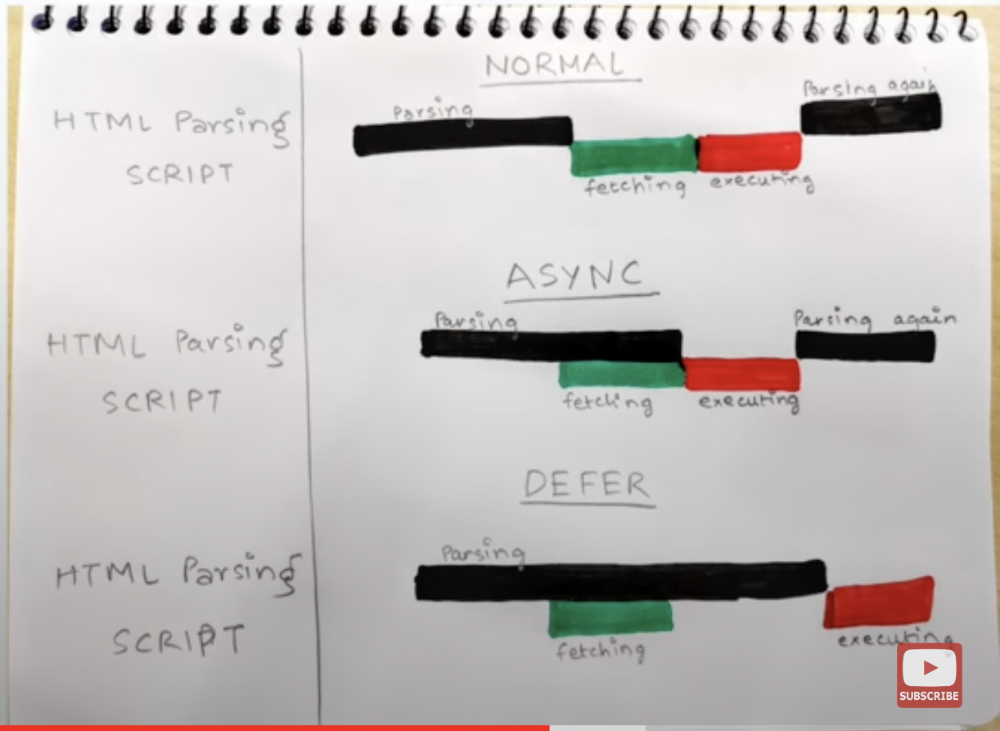

### What is Emmet?
- Provides code snippets for HTML.

### Difference between a Library and Framework?
- **Library:** You call the library functions as needed. Example: React.
- **Framework:** The framework calls your code. Example: Angular.

### What is a CDN? Why do we use it?
- A CDN (Content Delivery Network) is a collection of servers that work together to cache and deliver content to users around the world.
- Benefits: Caching, Faster loading times.

### Why is React known as React?
- React is called "React" because it helps applications efficiently "react" to changes in data, dynamically updating and rendering the user interface (UI) based on those changes.

### What is `crossorigin` in the `<script>` tag?
- It is used to handle cross-origin requests.

### What is the difference between React and ReactDOM?
- **React:** The core library responsible for creating components and managing their state and lifecycle.
- **ReactDOM:** Responsible for interacting with the DOM (Document Object Model). It provides methods to render React components into the actual DOM of a webpage.

### What is the difference between `react.development.js` and `react.production.js` files via CDN?
- **Development Version (`react.development.js`):** Larger file, includes helpful warnings and tools for debugging.
- **Production Version (`react.production.js`):** Smaller, faster, stripped of warnings and debug code, optimized for live applications.

### What are `async` and `defer`? 
- By default, HTML parsing is suspended until script is fetched and executed.
- `async` fetches the script in the background, then suspends the HTML parsing, executes the script as soon as it is fetched, and then resumes HTML parsing.
- `defer` fetches the script in the background and executes it as soon as the HTML parsing is complete.
